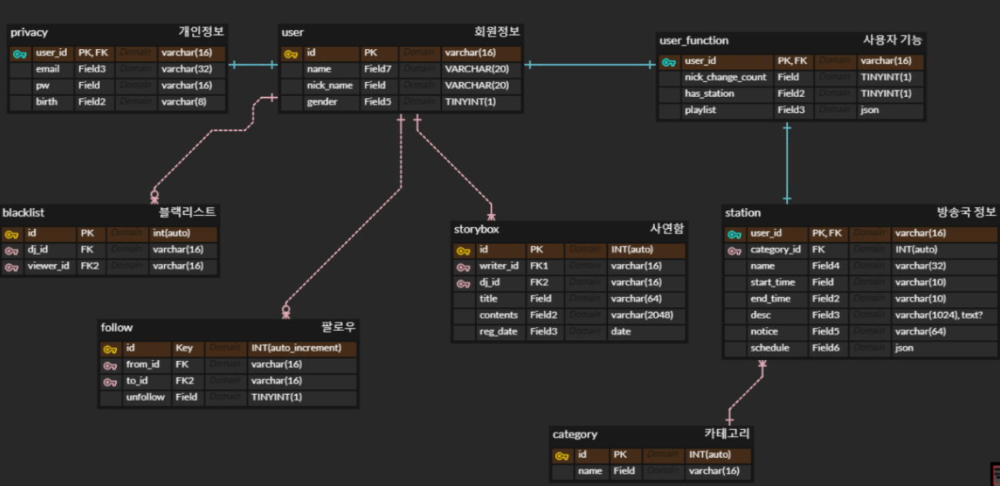
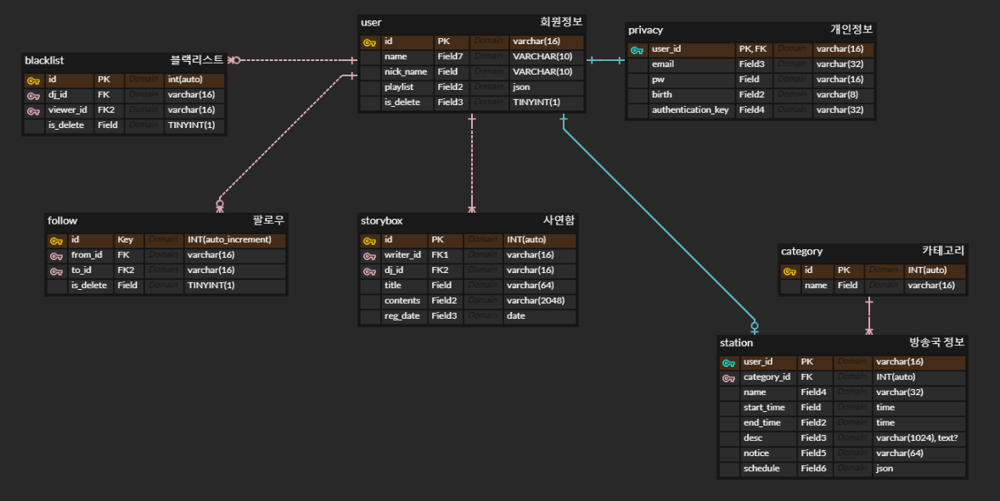

# 개발 일지

## 23.01.10
  
  ### 아이디어 회의 및 branch 생성.
  - 제안한 아이디어
    - 스터디 플랫폼
      - https://www.notion.so/0cc47669997d43c38edd677619cc2335#d8eb84f4c11548fc8f1558ef5a52ac19
  - 선정된 아이디어
    - 예술 경매 플랫폼 (김이슬)
      - https://www.notion.so/3e0b7cbc1efd45c892dc14f63fdf46c6#d9be59512c8e4e24808bee256a20037c
    - 화상회의 다시보기 최적화 서비스 (이상민)
      - https://www.notion.so/71de8af02f9b4e8da6a77519adaa01b8
    - 오늘 뭐먹지? (김우진)
      - https://www.notion.so/e3a4b717f9334e10ae969a448d3f9502

    - 예정 : 아이디어 초안(이력서 관리 플랫폼)을 고도화 시키면서 그대로 가져가거나 위 아이디어들을 가지고 컨설팅 받을 예정

  ### jpa 학습 진행 중.
  - EntityManagerFactory는 영속 단위 기준으로 초기화 한다.
    - persistence.xml 파일에 정의한 영속 단위 기준으로 초기화
    - 필요한 자원 생성
    - 커넥션풀과 같은 DB연동에 있어 필요한 자원을 생성한다.
  - EntityManager로 DB연동에 대한 모든 것을 처리한다.
  - EntityTransaction으로 트랜잭션 처리를 한다.
    - 모든 DB 작업은 트랜잭션이 열리고 닫히기 전에 처리한다.
  - CRUD : persist(), find(), remove()
    - update는 트랜잭션 사이에 바뀐 객체가 있다면 자동으로 반영이 된다.

## 23.01.11

  ### jpa 학습 진행 중.
  - 왜 JPA를 사용해야 하는가?
    - SQL 중심적인 개발에서 객체 중심의 개발
    - 패러다임 불일치 해결
      - 상속, 연관관계, 객체 그래프 탐색, 비교하기 같은 패러다임 불일치 해결
    - 개발자가 작성해야할 SQL과 JDBC API 코드를 JPA가 대신 처리해줌으로 유지보수 해야하는 코드가 줄어든다.
    - 생산성
      - 컬렉션에 객체를 저장하듯 JPA에게 저장할 객체를 전달
      - insert 쿼리를 작성하고 JDBC API를 사용하는 등의 일을 대신 처리
    - 유지보수
      - 엔티티에 필드 추가시 쿼리를 모두 변경해야 한다.
    
  - JPA의 성능 최적화 기능
    - 1차 캐시와 동일성 보장 : 캐싱 기능
      - 같은 트랜잭션 안에서는 같은 엔티티를 반환(크게 도움은 안되고 약간의 조회 성능 향상)
      - 결과적으로 SQL을 한 번만 실행
    - 트랜잭션을 지원하는 쓰기 지연 : 버퍼링 기능
      - 트랜잭션을 커밋할 때까지 INSERT(persist의 예를 들었을 경우) SQL을 메모리에 쌓는다.
      - JDBC Batch SQL 기능을 사용해 한 번에 SQL을 전송한다.
        - 지연 로딩 전략 옵션을 사용한다.
      - UPDATE, DELETE SQL의 경우 커밋 시 SQL 실행 후 바로 커밋.
      

## 23.01.12

  ### jwt 학습 진행 중.
  - jwt란?

    - RFC 7519
    - 세션과 같은 인증에서 자주 사용되며, json포맷을 이용하여 사용자에 대한 속성을 저장하는 Claim기반의 web token
    - Claim?
        - 사용자에 대한 포로퍼티, 속성을 의미
        - 토큰 자체가 정보를 가지고 있다는 뜻

  - 구성요소
    - `.` 으로 구분하여 3가지의 문자열로 구성
    - 헤더(header), 내용(payload), 서명(signature)으로 구성

  - 헤더(header)
    - 헤더에서는 해싱 알고리즘 방식을 지정, 서명 및 토큰 검증에 사용한다.
      - 공격
        - alg:none, role을 admin으로 하여 공격

  - 내용(payload)
    - 토큰에서 사용할 정보의 조각들인 클레임(Claim)이 담겨있다
      - 토큰의 내용은 확인이 가능하기 때문에 최소한의 정보를 넣어야 한다.
    - json형태로 key/value형태로 다수의 정보를 넣을 수 있다.
      - 너무많으면 토큰의 길이가 길어진다.
  
  - 클레임의 종류
    - 등록된 클레임
      - 서비스에 필요한 정보가 아닌, 토큰에 대한 정보들을 담기 위하여 이름이 이미 정해진 클레임
      - 클레임의 사용은 모두 선택적
      - `iss` : 토큰 발급자 (issuer)
      - `sub` : 토큰 제목 (subject)
      - `aud` : 토큰 대상자 (audience)
      - `exp` : 토큰의 만료 시간(expiration), 시간은 NumericDate 형식으로 되어있어야 하며 언제나 현재 시간보다 이후로 설정되어 있어야 합니다.
      - `nbf` : Not before을 의미하며, 토큰의 활성 날짜와 비슷한 개념입니다. 여기에도 NumericDate형식으로 날짜를 지정하며, 이 날짜가 지정하며, 이 날짜가 지나기 전까지는 토큰이 처리되지 않습니다.
      - `iat` : 토큰이 발급된 시간(issued at), 이 값을 사용하여 토큰의 age가 얼마나 되었는지 판단 할 수 있습니다.
      - `jti` : JWT의 고유 식별자로서, 주로 중복적인 처리를 방지하기 위하여 사용됩니다. 일회용 토큰에 사용하면 유용합니다.
    - 공개 클레임
      - 충돌이 방지된 이름을 가지고있어야 합니다. 충돌을 방지하기 위해 URI형식으로 짓습니다.

    - 비공개 클레임
      - 양측 (클라이언트, 서버)간에 합의하에 사용되는 클레임
      - 임의로 지정한 정보를 저장
      - 중복되지 않도록 유의해야 합니다.

    - 서명(Signature)
      - 유효성 검증을 할때 사용하는 고유한 암호화 코드
      - 헤더의 인코딩값, 정보의 인코딩값을 합친후, 주어진 비밀키로 해쉬하여 생성
        - salt
    - bcrypt
      - 해쉬알고리즘에서 최고
      - 해쉬를 중첩해서 사용하는 방식
      - 시간을 오래걸리도록 한다.
    - 이를 base64형태로 나타낸다.
      

## 23.01.13

  ### 아이디어에 대한 기능 명세서 작성
  - https://docs.google.com/spreadsheets/d/1SvHaiSLpfYrtSsCLZ3nhX-IG6ETO2vTrMs1dwcksTqo/edit#gid=0

## 23.01.16

  ### 기획 최종 컨설팅 회의록 및 데이터 설계
  - 채팅 필터링 (네이버 오픈소스)
  - 사연자가 방에 참여했는지 안했는지를 리스트로 확인 가능하게(내가 원하는 사람의 실시간 connection정보) - session서버 필요 ⇒ 접속중인지 알 수 있는 API 필요 (call by call은 불가)
    - 슈퍼챗기능(사연자) 채팅화면에 고정시키는 것………..!?
  - 접속자 정보를 다 알고 있는 것이 중요
  - 고정시간을 어떻게 관리할 것인가. 정해진 편성표 기준으로 추천알고리즘을 짜기 때문에 경고 보다 자율적인 규제가 가능할듯.
  - 추천알고리즘
    - 로그인 이후에 메인화면에서 추천알고리즘을 보여주게 된다면 낭비되는 리소스가 많을 것. (효율적인 방법을 고려해보기)
    - 최대 접속자 채널을 어떻게 저장할것인지.
    - 구독자 수 sorting list == 세션에 있는 리스트 해서 출력
  - 실시간 구독자 수 기능
    - 캐시서버를 사용해야함.
    - spring캐시로 사용 안됨
    - 로그 DB필요
    - 실시간으로 갱신을 할 건지, 아니면 하루에 한 번만 갱신을 할 건지 고민
    - 전체 유저 대비 DJ의 비율에 대해 시장조사(스푼라디오, 유튜브 …)
    - DJ 누구를 팔로우 언제 > DJ 누구를 팔로우 해제 언제 (log data)
    - 최초 시점을 DJ 개설할 때 구독자 수를 가져올 수 있음.(마이페이지에 방송정보를 입력할 때가 최초 시점)
    - DB에 적혀있는 log는 복원용,
    - 누가 팔로우 하면 버퍼 +1되는 api호출
    - 오차 감안 ~~~!!!!
    - 하루에 한번은 DB랑 맞는지 확인하고싶어 !!!!! (사람이 가장 없는 시간에 팔로우 log 정보를 분석해서 정확한 count 뽑아온다)
    - 이후 overwrite.(의 반복~~)
    - 일주일동안 아무도 나를 팔로우/팔로잉 하지 않을 경우 삭제 > 삭제하기 전에 백업table  > 그냥 프로필DB 에 저장 (해당 DB에 하루한번씩 overwrite)
    - 배치JOB , JOB Queue
  - 전화번호 없어도 괜찮다
  - 관리자 페이지 없어도 될듯 (Super계정 필요없음)
  - 카테고리 알아서(meta table로 빼세요)
  - reg_date 저장
  - 개인의 편성표 ..
  - sorting은 db에서 하지마라
  - order by,like,delete는 없음
  - 검색은 어떻게 검색할것인지, 뭘 검색할것인지 고려해볼것
  - S22크기에 맞춰서 모바일 화면 하나 더 만드는걸로.

## 23.01.17

### ERD 작성 및 데이터 설계

- 하위 작성 내용은 데이터 설계 내용

잔잔한 이런거 로그에다가 저장

### RDB
- 사용자(user)
    - id(PK, auto)
    - email
    - password
    - nickname
    - birth_date
    - gender
    - playlist(string,**따로 빼야하는가? 보류)**
    - has_station - 방송국을 열었니 안 열었니

- 방송국(station)
    - user_id(pk, fk)
    - name(이름)
    - start_time
    - end_time
    - category_id(카테고리 아이디)
    - desc(설명)
    
- category(카테고리)
    - id(pk, auto)
    - name(카테고리명, music, book, dubbing, asmr, counsel, interview, news, enter, edu, story)
    
- storybox (사연함)
    - story_id (auto_increment)
    - writer_code (작성자 code, fk)
    - dj_code(dj code, fk)
    - title
    - contents
    - reg_date

- blacklist
    - id (auto_increment)
    - dj_code(dj code, fk)
    - viewer_code(시청자 code, fk)

- follow
    - id(auto_increment)
    - from_id(팔로우 한 사람 code, fk)
    - to_id(팔로우 당한 사람 code, fk)
    
- **file( s3 서버)(보류)**
    - 사용자 id
    - 프로필 사진
        - 크기, type, 이름, date
    - 방송 배너 사진
        - 크기, type, 이름, date

---

### log DB

- broadcast_log(방송로그)
    - id (방송 로그 자체 pk, auto_increment)
    - dj_id (fk)
    - title (방송 제목)
    - is_ontime (시간 지켰는지)
    - broad_date (방송 날짜)
    - mood (분위기들, 문자열로 묶어서 저장)

- view_log (3분의 1이상 본 사람만 보내주세요)
    - id (view 로그 자체, pk, auto)
    - viewer_id(시청자 코드, fk)
    - broad_log_id (방송로그의 id)

### ERD 링크
https://www.erdcloud.com/d/xgrYs932xBu9qABDb

## 23.01.18

### ERD 및 화면설계 컨설팅 및 피드백 정리
- Front : 메인 배너의 화면비는 어떻게 맞출건지? -> 비율이 각각 달라 구현 힘들다.
- Back
  - 메인화면 최초 sorting 시 어떻게 할 것인지 고려 -> 방송 시간(켠 시간)에 따른 sorting
  - 분위기 태그를 다 선택 가능하다면 그 사람이 추천 알고리즘에 유리한 것이 아니냐? -> 고려해봐야 할듯..
  - 개인정보는 테이블 관리가 따로 필요하다. -> user 테이블을 각 기능별로 나눠 관리가 필요.
  - 본인인증에 대한 이메일 인증? -> 너무 약하다. Third Party 인증을 적용해보자.
  - 플레이리스트 테이블은 굳이 안빼고 현재 방식대로 진행해도 될듯. (json 정보를 저장)
  - has station 필드를 테이블로 따로 빼는 것을 고려해보자.
  - 팔로우 : 단일 데이터(나를 팔로우한 사람들의 목록을 고려하지 않았으므로)이므로 배열 형태로 저장하자.
  - 방송 생성 / 종료 시점에 필요한 로그 테이블이 있어야 한다.
    - title에 대한 명시 필요.(현재 종료 시점 로그 테이블에 들어가 있는데 생성 시점 테이블을 만들어 거기에 넣어야 한다.)
  - view log table : 시청자 in / out 시간에 대한 데이터가 필요하다.
  - 나만의 on air
    - db에서 팔로우 리스트를 땡겨오고 세션에 정보를 넘겨준 후에 세션에 살아있는 정보를 던져주는 식으로 구현된다.
  - 사연함
    - 삭제는 안된다.
    - 방송중에 들어오는 사연은 어떻게 할 것인지?

## 23.01.19

### ERD 수정 및 데이터 설계 회의
- 

## 23.01.20

### ERD 최종 완성 및 화면 설계

- 화면 설계 : https://www.figma.com/file/Y3qL2nVh2N7zWtcpQso8xk/BORA?node-id=69%3A222&t=E99inzaNOJxtG1zR-0
